# Pagezy — Free Offline PDF Reader, Editor & OCR (Windows, Linux, macOS)

**Pagezy** is a free desktop **PDF reader and editor** that works entirely on
your own computer. Read, comment, edit, organize, fill and sign, redact, OCR
scans, convert to Word, Excel and PowerPoint, and compare versions — with **no
account, no subscription, no cloud and no telemetry**.

**Every PDF tool. Nothing leaves your PC.**

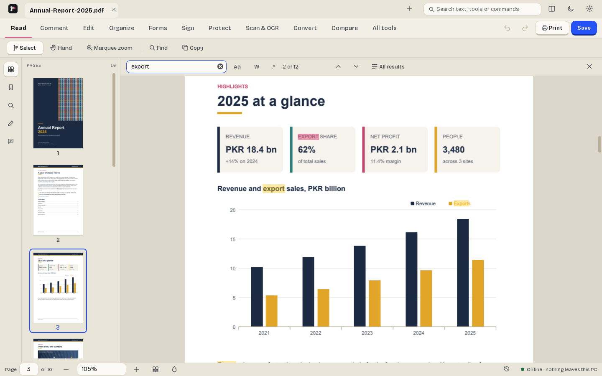

---

## Key features

| | |
|---|---|
| 📖 **Read** | Tabs and split view, zoom and fit, single / two-page / continuous layouts, night pages, bookmarks, thumbnails, presentation mode and read aloud. Ctrl F highlights every match as you type; **Search in folder** finds text across a whole folder of PDFs. |
| 💬 **Comment** | Highlights, notes, text boxes, shapes, freehand, stamps and measurements, with a comments list you can reply in, filter and export. |
| ✏️ **Edit** | Click a paragraph and change it — Pagezy matches the file's own font. Add or replace images, links, headers and footers, watermarks and Bates numbers. |
| 🗂️ **Organize** | Reorder, rotate, delete, insert and extract pages in a grid. Combine files, split them, crop pages and **compress to a target size**. |
| 📝 **Fill & sign** | Fill any form (calculations run safely — PDF scripts never run), make your own forms, and sign with a drawn, typed or image signature, or a certificate. |
| 🛡️ **Protect** | Passwords and permissions, and **true redaction** that removes the content and checks the result. Find and redact CNIC numbers, phone numbers and emails in one go. |
| 🔍 **Scan & OCR** | Make scanned pages searchable, offline. Clean up scans, import from a scanner, or **use your phone as a scanner** over Wi-Fi. |
| 🔄 **Convert** | Export to **Word, Excel, PowerPoint**, images, text and HTML; extract tables; PDF/A, preflight and accessibility checks; booklet and n-up printing. |
| ⚖️ **Compare** | Two versions side by side, with every change listed. |
| ⌨️ **Ctrl K** | Type what you want to do and press Enter. Every command shows its shortcut. |
| 🎨 **Comfortable** | Light and dark themes, bigger text, crash recovery, and a **portable edition** for Windows that runs from a USB stick. |

---

## Screenshots

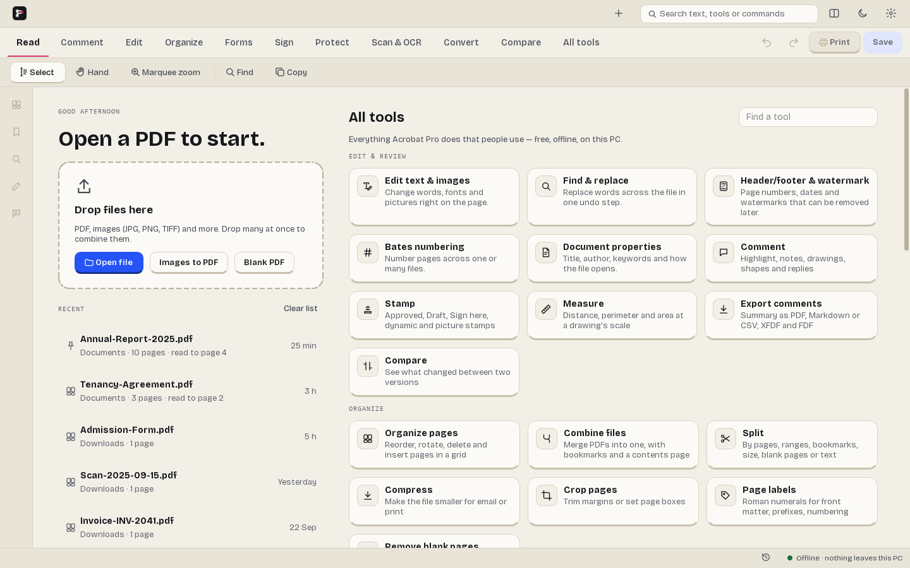 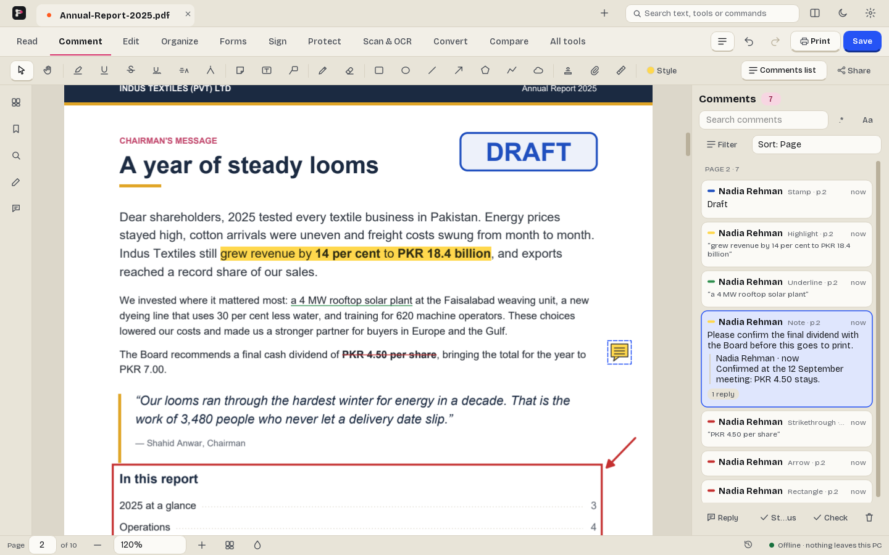

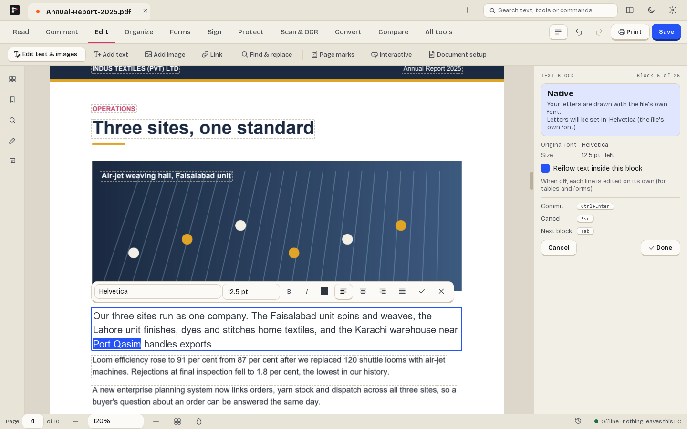 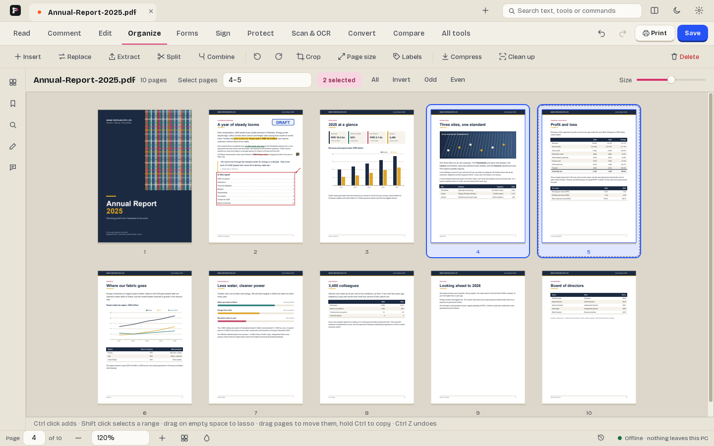

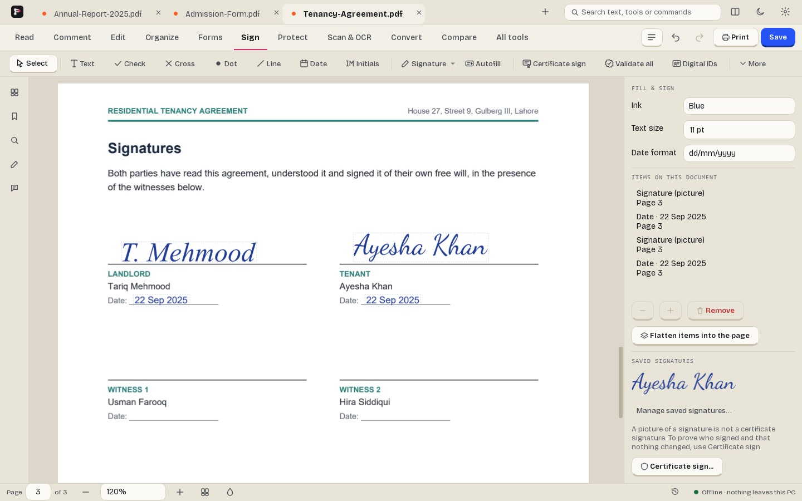 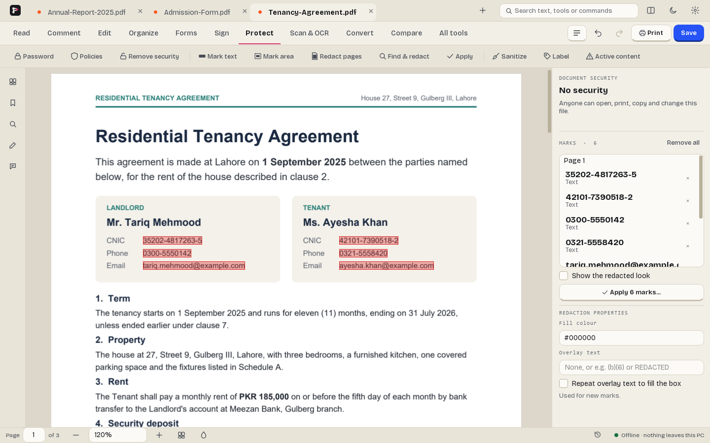

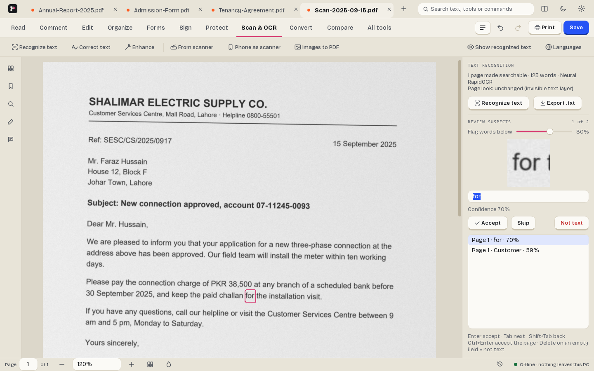 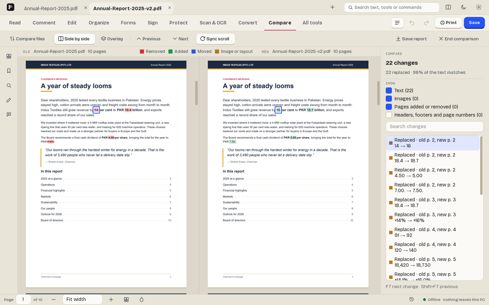

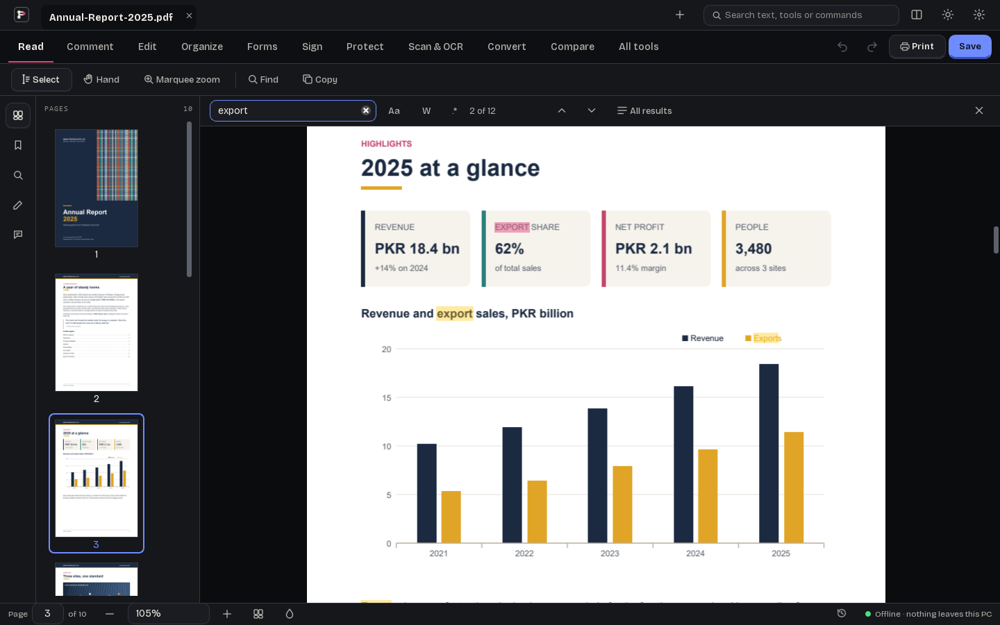 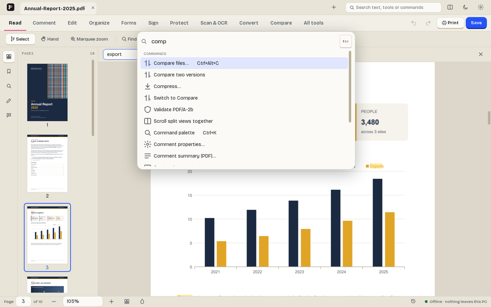

---

## Download & install

Everything is on the **[Releases](../../releases)** page.

| Download | Platform |
|---|---|
| `PagezySetup.exe` | **Windows 10/11** (64-bit): run the installer |
| `Pagezy-portable-win64.zip` | **Windows portable**: unzip anywhere and run `Pagezy.exe` |
| `Pagezy-x86_64.AppImage` | **Linux** (x86_64): `chmod +x` it, then run it |
| `Pagezy-macOS-arm64.dmg` | **macOS** (Apple Silicon), when a release includes one |
| `manifest.json` | SHA-256 checksums of every file in the release |

> **macOS:** a `.dmg` is not built for every release. When there is one, it is
> unsigned: the first time, right-click Pagezy in Applications and choose
> **Open**.

---

## FAQ

**What does it cost?**
Nothing. Pagezy is free and stays free. There is no paid tier.

**Does it need an account?**
No. No sign-up, no login, no licence key.

**Are my files uploaded anywhere?**
No. Everything — OCR, conversion, comparison — happens on your computer. Pagezy
has no cloud features at all.

**Does it phone home?**
No telemetry and no analytics. Pagezy checks this page for a new version once a
day; the request carries nothing about you or your files, and you can switch it
off on the first screen or in Settings. Apart from that it only connects for
downloads you start yourself. Settings keeps a log of every connection. Details
are in the [privacy policy](privacy-policy.html).

**How do updates work?**
When a new version is out, Pagezy shows a quiet notice and the release notes
first. Nothing downloads until you click. On Windows it then installs the update
by itself and reopens the documents you had open. You can also skip a version.

**Windows says "Windows protected your PC". Is it safe?**
That is Microsoft SmartScreen. It appears for new apps that are not yet
code-signed, which Pagezy isn't yet. Click **More info**, then **Run anyway**.
You can check the file against the SHA-256 in `manifest.json` on the release.

**Can Pagezy be my default PDF app?**
Yes. The installer can register it for `.pdf` files (an option on the last
page). On Windows 10 and 11, open **Settings › Apps › Default apps › Pagezy** to
confirm the choice; Windows doesn't let any app set itself as default.

**Does OCR work for Urdu?**
Yes, with [Tesseract](https://github.com/UB-Mannheim/tesseract/wiki) installed
(tick Urdu during its setup). English and other Latin scripts work out of the box.

**Is it open source?**
Pagezy is MIT-licensed. This repository publishes the builds; the source is not
published here yet.

---

## Support this project

Pagezy is built by one person, in the evenings. If it saved you a subscription,
you can chip in:

### ❤️ [patreon.com/zylio](https://www.patreon.com/zylio)

**Nothing is locked behind it.** Every feature is available to everyone,
whether or not anybody ever contributes. There will not be a supporters-only
build.

---

**Keywords:** free PDF reader, free PDF editor, offline PDF editor, Acrobat
alternative, PDF OCR, edit PDF text, redact PDF, sign PDF, fill PDF form, PDF to
Word, PDF to Excel, compare PDF, merge PDF, split PDF, compress PDF, PDF viewer
for Windows, PDF viewer for Linux, PDF reader for Mac, no subscription, portable
PDF reader, dark mode PDF reader, no ads, no telemetry, no account.

---

Built by **[zylio](https://zylio.net)**, an independent software studio making
fast, honest tools.

**Product page:** [zylio.net/software/pagezy](https://zylio.net/software/pagezy)

© 2026 zylio · Faisal Malik. Pagezy is released under the MIT licence.
